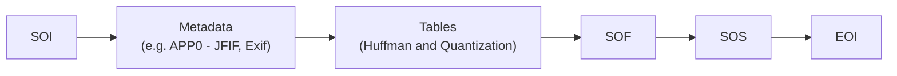

# jpeg.c

JPEG specs
- https://www.w3.org/Graphics/JPEG/itu-t81.pdf
- https://www.w3.org/Graphics/JPEG/jfif3.pdf

Only JPEG Baseline is implemented. Basic support for restart markers.

Some test images: https://www.w3.org/MarkUp/Test/xhtml-print/20050519/tests/A_2_1-BF-01.htm

- In general, to ensure safe decoding, we need to do quite a lot of checks i.e. make sure resources, like Huffman tables, are initialized before use, the values are within expected range (otherwise we might index out of bounds).
- JPEG/JFIF does not limit the range of values for component identifier. It is 1 byte, so theoretically the possible values are [0, 255]. Most proper JPEGs use 1, 2, 3 for RGB, but a few, like https://www.w3.org/MarkUp/Test/xhtml-print/20050519/tests/jpeg444.jpg, use 0, 1, 2 instead. Note that the standard says decoders only need to support up to 4 components in a scan (Adobe standard with APP13 or APP14 markers may interpret 4 components as CMYK). 

## Build

Linux and MacOS

```bash
make test_all
```

Windows

```bash
cl test.c jpeg.c && ./test sample.jpg
```

## Decode flow

Check Figure E6-E10 of ITU-T.81

Most basic: Baseline JPEG, no restart.


